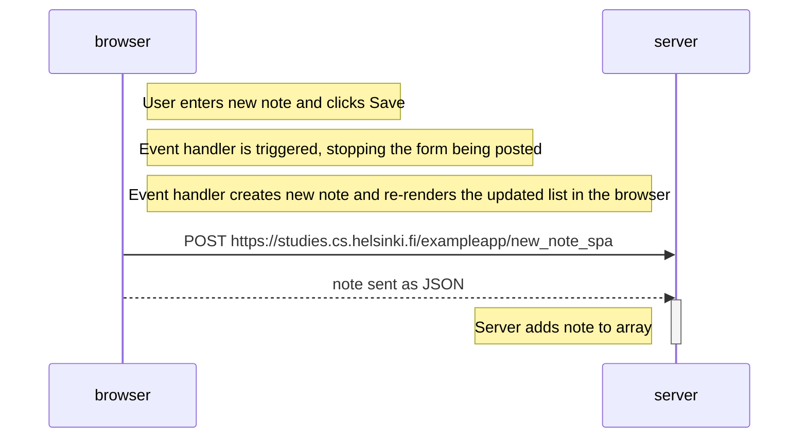

Diagram for excerise Part 0.6
Single page app - adding new note

```mermaid
sequenceDiagram
    participant browser
    participant server


    Note right of browser: User enters new note and clicks Save
    Note right of browser: Event handler is triggered, stopping the form being posted
    Note right of browser: Event handler creates new note and re-renders the updated list in the browser
    
    
    
    browser->>server:POST https://studies.cs.helsinki.fi/exampleapp/new_note_spa
    browser-->>server: note sent as JSON
    activate server
    Note left of server: Server adds note to array
    deactivate server


```

Tim Nightingale
23 Jul 2024